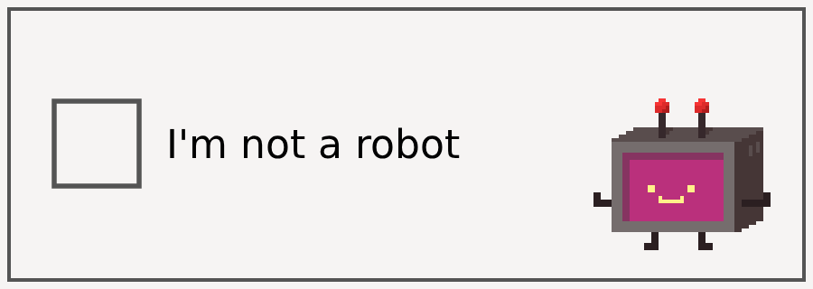

# JB Service Documentation

## Accounts and Authentication
...
## Security
...

### Rate Limiting
...
### IP Blacklisting
...
### CAPTCHA

#### Overview
A CAPTCHA test is designed to distinguish whether a user is human or a bot. The tests can range from a tick the box to typing characters you see in the image and much more. These tests are an effective yet simple prevention against malicious bot actions such as spamming and brute-forcing.

Example CAPTCHA illustration:


Despite its security benefits, CAPTCHA tests are not implemented at every point of interaction with the web to avoid interrupting user flow. Hence, these tests have trigger conditions which automatically start them. Our service has 5 trigger conditions which are explained in detail in the following section.

#### Trigger Conditions
Our service shows a CAPTCHA if any of these 5 scenarios occur:


Note:
The numbering of conditions in the diagram reflects the order of explanations in this document. All conditions are evaluated independently and not in a sequential order. <br>

---
1. High request volume from the same IP address
---
**Condition:**
More than 500 requests from the same IP address in less than 20 minutes.

**Purpose:**
Prevents automated attacks from the same source.

**Example scenarios:**
**Possible malicious activity:**
* Web crawlers and bots parsing content
* Brute force attacks designed to exhaust service resources.
<br>
**Possible legitimate causes:**
* Multiple real users accessing the service through a shared network.
* A malfunctioning browser extension.
* The client repeatedly sends requests.


**Update thresholds:**
The request threshold and time window can be adjusted through the service configuration. <br>
See: `config/captcha/rate-limit.yaml`

---
2. Request from IP address in blacklist
---
**Condition:**
If the IP address from which the request is received is found in the blacklist.

**Purpose:**
Blocks requests from known and identified attackers, flagged sources, spam etc.

**Example scenarios:**
* An IP address previously detected sending spam submissions.
* Known bot networks used for automated attacks.


**Update Blacklist:**
The blacklist is managed through the Admin Panel. <br>

Admin Panel &rarr; Security &rarr; IP Blacklist <br>

Administrators can add or remove IP addresses from this list as needed.

---
3. Abnormally high traffic
---
**Condition:**
If the number of requests received during the current hour exceeds twice the average number of requests for that same hour in the past 2 weeks.

**Purpose:**
Detects unusual traffic peaks caused by multiple devices.

**Example scenarios:**
**Possible malicious activity:**
* Distributed bots sending different requests or targeting a specific form

**Possible legitimate causes:**
* A marketing campaign or social media post directing many users to the service or a specific form.

**Update thresholds:**
The time window and the request threshold can be adjusted through the service configuration. <br>

See: `config/captcha/traffic-monitoring.yaml`

---
4. Repeated Payloads
---
**Condition:**
If the same payload is submitted more than 5 times within 30 seconds.

**Purpose:**
Detects spam attempts where identical requests are submitted within a short time window.

**Example scenarios:**  
**Possible malicious activity:**  
* A bot or script submitting identical spam messages.

**Possible legitimate causes:**  
* A user repeatedly resubmitting a form due to connection issues.
* An integration or API client retrying failed requests without modifying the payload.

An example payload can look like the snippet below:

```json
// Example payload structure
{
"email": "...",
"comment": "...",
"date": "..."
}
```

**Update thresholds:**
The payload repetition threshold and time window can be adjusted through the service configuration. <br>
See: `config/captcha/rate-limit.yaml`

---
5. Admin Enabled CAPTCHA
---

**Condition:**
If the CAPTCHA is enabled manually through the Admin Panel for certain requests.

**Purpose:**
Allows administrators to enforce CAPTCHA when additional protection is required or during testing.

**Example scenarios:**
* Suspicious traffic detected before automatic triggers have been activated.
* Temporarily enabling CAPTCHA during a security incident.
* Enforcing CAPTCHA on a new deployment until traffic patterns are established.

**Update selection of request:**
Administrators can configure which requests trigger CAPTCHA through the Admin Panel. <br>
Admin Panel &rarr; Security &rarr; CAPTCHA Triggers

#### Troubleshooting and FAQ
* Why is CAPTCHA not appearing for testing?

CAPTCHA will not appear if none of the conditions described in the
[Trigger Conditions](#trigger-conditions)
section are met. The easiest way to test CAPTCHA behaviour internally is to enable it through the Admin Panel. <br>

Admin Panel → Security → CAPTCHA Triggers <br>

Other testing methods include simulating high request volume or repeated payloads via scripts:<br>

Simulating high request from the same IP:  `high_requests.py` <br>
Simulating repeated payloads: `repeated_requests.py`<br>

---
* How to check which condition triggered the CAPTCHA?

All triggering conditions are logged temporarily (24 hours) in service request logs.
These logs can be accessed through the [service logs](service_logs)

```
Example log entry
{
  "timestamp": "2026-03-08T14:22:31Z",
  "event": "captcha_triggered",
  "trigger_condition": "IP_RATE_LIMIT",
  "source_ip": "192.168.10.45",
  "request_count_last_20m": 534,
  "endpoint": "/forms/submit"
}
```

The `trigger_condition` field indicates why the CAPTCHA was triggered.
<br>

---
* Can legitimate users trigger CAPTCHA?

Yes, in some situations CAPTCHA may be triggered by legitimate users. Common situations include:
*   Shared IP networks (offices, universities, public Wi-Fi etc.)
*   Repeated form submissions due to connection issues
*   Automated tools or browser extensions that repeatedly retry failed submissions.


#### Future Improvements
As technologies such as AI continue to improve, traditional CAPTCHA tests become less of a challenge for bots to solve. To maintain long term protection, the team is evaluating additional security mechanisms to accompany or replace CAPCTHA.
<br>

**Machine Learning Based Behaviour Detection**<br>
Lightweight ML models that analyze request patterns and timing is being explored to differentiate between real users and bots <br>
See: [placeholder link to project](ml-based behaviour-detection)

**Optional 2 Factor Verification for Account Creation**<br>
The JetBrains service may introduce phone number verification or another form of 2FA during account creation to reduce account base abuse across the service.<br>
See: [placeholder link to project](2FA-account)

**Proof of Work Puzzle**<br>
A potential alternative to traditional CAPTCHA is a lightweight client side PoW challenge, where the browser performs a small computational task before a request proceeds. This increases the cost of automated attacks without impacting typical users. <br>
See: [placeholder link to project](PoW)

